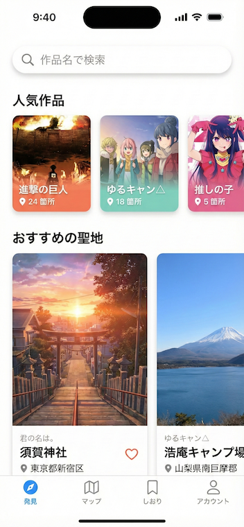

# 画面一覧

各タブ内の画面と、共通で使われる画面を整理したドキュメントです。

---

## 画面一覧表

全 21 画面の概要を表形式で表示しています。

| #   | 画面 ID               | 画面名                       | カテゴリ       | 概要                               |
| --- | --------------------- | ---------------------------- | -------------- | ---------------------------------- |
| 1   | `explore_top`         | 発見トップ画面               | 発見タブ       | 新しい聖地を見つけるための入口     |
| 2   | `anime_search`        | 作品検索画面                 | 発見タブ       | 作品名でキーワード検索             |
| 3   | `search_results`      | 検索結果画面                 | 発見タブ       | 検索結果の作品一覧を表示           |
| 4   | `anime_detail`        | 作品詳細画面                 | 発見タブ       | 作品情報とその作品の聖地一覧       |
| 5   | `map`                 | 地図画面                     | マップタブ     | 地図上に聖地をピン表示             |
| 6   | `map_filter_modal`    | フィルター設定モーダル       | マップタブ     | 地図に表示する聖地を絞り込み       |
| 7   | `saved_list`          | お気に入り一覧画面           | しおりタブ     | 行きたい聖地のリスト               |
| 8   | `account_top`         | アカウントトップ画面         | アカウントタブ | ユーザー情報と過去の記録を管理     |
| 9   | `profile_edit`        | プロフィール編集画面         | アカウントタブ | ユーザー情報を編集                 |
| 10  | `visited_list`        | 訪問済みリスト画面           | アカウントタブ | 訪問済みの聖地一覧                 |
| 11  | `my_reviews`          | レビュー一覧画面             | アカウントタブ | ユーザーが投稿したレビュー一覧     |
| 12  | `my_spot_submissions` | 投稿した聖地一覧画面         | アカウントタブ | 投稿した聖地のステータス確認       |
| 13  | `my_anime_requests`   | リクエストした作品一覧画面   | アカウントタブ | リクエストした作品のステータス確認 |
| 14  | `settings`            | 設定画面                     | アカウントタブ | アプリの設定変更                   |
| 15  | `spot_detail`         | 聖地詳細画面                 | 共通           | 聖地の詳細情報（最重要画面）       |
| 16  | `review_post`         | レビュー投稿画面             | 共通           | 聖地に対してレビューを投稿         |
| 17  | `spot_submit`         | 聖地登録画面                 | 共通           | ユーザーが新しい聖地を投稿         |
| 18  | `anime_request`       | 作品リクエスト画面           | 共通           | 新しい作品の追加をリクエスト       |
| 19  | `spot_reviews`        | レビュー一覧画面（聖地ごと） | 共通           | 特定の聖地のレビュー全表示         |
| 20  | `login`               | ログイン画面                 | 認証           | ソーシャルログイン                 |
| 21  | `onboarding`          | オンボーディング画面         | 認証           | 初回ログイン時のアプリ紹介         |

---

## 1. 発見タブ（Explore）

### 1.1 発見トップ画面

**画面 ID**: `explore_top`

**概要**: 発見タブのホーム画面。新しい聖地を見つけるための入口。

**主な要素**:

- 検索バー（作品名検索）
- 人気作品一覧
  - 作品カード（作品名、聖地数、サムネイル）
  - タップで作品詳細へ遷移
- おすすめ聖地セクション
  - 新着聖地
  - 話題の聖地
  - 聖地カード（写真、作品名、場所名）
- カテゴリフィルター（任意）

**遷移先**:

- 作品検索画面
- 作品詳細画面
- 聖地詳細画面

**プロンプト**:

```
アニメ聖地巡礼アプリの「発見トップ画面」のモバイルアプリデザインを作成してください。

【アプリ概要】
- アニメの聖地（ロケ地）を探して訪問するためのアプリ
- ユーザーは作品名から聖地を検索したり、おすすめの聖地を発見したりできる
- 日本語と英語の多言語対応

【画面の目的】
新しい聖地を見つけるための入口となるホーム画面。ユーザーがワクワクしながら次の巡礼先を探せるようにする。

【必須の UI 要素】
1. 上部：検索バー
   - プレースホルダー：「作品名で検索」
   - 虫眼鏡アイコン付き
   - タップすると検索画面へ遷移

2. 中央：人気作品セクション
   - セクションタイトル：「人気作品」
   - 横スクロール可能なカードリスト
   - 各カード：作品のサムネイル画像、作品名、聖地数（例：「15 箇所」）
   - カードサイズ：横長、幅 200px 程度

3. 下部：おすすめ聖地セクション
   - セクションタイトル：「おすすめの聖地」
   - 縦スクロール可能なカードリスト
   - 各カード：聖地の写真、作品名、場所名（例：「君の名は。- 須賀神社」）
   - カードサイズ：横幅いっぱい、写真は 16:9 比率

【デザインスタイル】
- トーン：明るく、親しみやすく、冒険心をかき立てる
- カラー：爽やかなブルーやグリーンを基調に、アクセントカラーでオレンジやピンクを使う
- フォント：読みやすく、モダンなサンセリフ
- 余白：適度な余白でリラックスした印象
- 写真：風景写真が映える、写真を主役にしたレイアウト

【プラットフォーム】
- iOS / Android 対応のモバイルアプリ
- 画面サイズ：iPhone 14 Pro (393 x 852 px) を基準
- ボトムナビゲーション：発見、マップ、しおり、アカウント の 4 タブ

【参考デザイン】
- Airbnb のような旅行アプリの雰囲気
- Pinterest のような写真が映えるカードレイアウト
- 食べログやトリップアドバイザーのような発見型 UI

【出力形式】
高解像度のモックアップ画像（PNG または Figma ファイル）
```

**参考画像**:


---

### 1.2 作品検索画面

**画面 ID**: `anime_search`

**概要**: 作品名でキーワード検索する画面。

**主な要素**:

- 検索入力フィールド
- 検索履歴
- サジェスト機能（入力中に候補表示）
- 人気作品のクイックアクセス

**遷移先**:

- 検索結果画面
- 作品詳細画面

---

### 1.3 検索結果画面

**画面 ID**: `search_results`

**概要**: 検索キーワードに該当する作品一覧を表示。

**主な要素**:

- 検索キーワードの表示
- 作品リスト
  - 作品名（日 / 英）
  - 聖地数
  - サムネイル
- 結果がゼロの場合のメッセージ
  - 「作品をリクエスト」ボタン

**遷移先**:

- 作品詳細画面
- 作品リクエスト画面

---

### 1.4 作品詳細画面

**画面 ID**: `anime_detail`

**概要**: 選択した作品の情報と、その作品の聖地一覧を表示。

**主な要素**:

- 作品情報
  - 作品名（日 / 英）
  - 作品サムネイル
  - 簡単な説明（任意）
- 聖地一覧
  - リスト表示 / 地図表示の切替
  - 聖地カード（写真、場所名、住所）
- FAB: 「聖地を追加」ボタン

**遷移先**:

- 聖地詳細画面
- 聖地登録画面（ユーザー投稿）

---

## 2. マップタブ（Map）

### 2.1 地図画面

**画面 ID**: `map`

**概要**: 地図上に聖地をピン表示し、現在地周辺の聖地を探す。

**主な要素**:

- 地図（Google Maps / Mapbox）
- 聖地のピン（複数）
  - 作品ごとに色分け（任意）
  - タップで簡易情報のポップアップ
- 現在地ボタン（マイロケーション）
- フィルターボタン
  - 作品別フィルター
  - 距離フィルター
- 検索バー（任意）

**遷移先**:

- 聖地詳細画面
- フィルター設定モーダル

---

### 2.2 フィルター設定モーダル

**画面 ID**: `map_filter_modal`

**概要**: 地図に表示する聖地を絞り込む設定画面。

**主な要素**:

- 作品選択（複数選択可）
- 距離範囲スライダー（1km, 5km, 10km, 50km など）
- 「適用」ボタン
- 「クリア」ボタン

**遷移先**:

- 地図画面（フィルター適用後）

---

## 3. しおりタブ（Saved）

### 3.1 お気に入り一覧画面

**画面 ID**: `saved_list`

**概要**: ユーザーが「行きたい」に追加した聖地の一覧。

**主な要素**:

- 表示切替（リスト / 地図）
- 聖地リスト
  - 聖地カード（写真、作品名、場所名、住所）
  - スワイプで削除（任意）
- 並び替え・フィルター
  - 作品別
  - 地域別
  - 追加日順
- 空の状態メッセージ
  - 「まだお気に入りがありません」
  - 「聖地を探す」ボタン → 発見タブへ

**遷移先**:

- 聖地詳細画面
- 発見タブ

---

## 4. アカウントタブ（Account）

### 4.1 アカウントトップ画面

**画面 ID**: `account_top`

**概要**: ユーザー情報と過去の記録を管理する画面。

**主な要素**:

- プロフィールセクション
  - ユーザー名
  - アイコン
  - 編集ボタン
- 統計情報
  - 訪問数
  - レビュー数
  - 投稿数
- メニューリスト
  - 訪問済みリスト
  - 自分のレビュー
  - 投稿した聖地
  - リクエストした作品
  - 設定
  - ログアウト
  - 退会

**遷移先**:

- プロフィール編集画面
- 訪問済みリスト画面
- レビュー一覧画面
- 投稿した聖地一覧画面
- リクエストした作品一覧画面
- 設定画面

---

### 4.2 プロフィール編集画面

**画面 ID**: `profile_edit`

**概要**: ユーザー情報を編集する画面。

**主な要素**:

- アイコン変更
- ユーザー名入力
- 自己紹介（任意）
- 保存ボタン

**遷移先**:

- アカウントトップ画面（保存後）

---

### 4.3 訪問済みリスト画面

**画面 ID**: `visited_list`

**概要**: ユーザーが「訪問済み」にチェックした聖地の一覧。

**主な要素**:

- 聖地リスト
  - 聖地カード（写真、作品名、場所名）
  - 訪問日の表示
- 並び替え
  - 訪問日順
  - 作品別
- 空の状態メッセージ

**遷移先**:

- 聖地詳細画面

---

### 4.4 レビュー一覧画面

**画面 ID**: `my_reviews`

**概要**: ユーザーが投稿したレビューの一覧。

**主な要素**:

- レビューリスト
  - 聖地名
  - 評価（星）
  - コメント抜粋
  - 写真サムネイル
  - 投稿日
- 編集・削除ボタン

**遷移先**:

- レビュー詳細画面
- レビュー編集画面

---

### 4.5 投稿した聖地一覧画面

**画面 ID**: `my_spot_submissions`

**概要**: ユーザーが投稿した聖地の一覧とステータス確認。

**主な要素**:

- 投稿リスト
  - 聖地名
  - 作品名
  - ステータス（承認待ち / 承認済み / 却下）
  - 投稿日
- ステータス別フィルター
- 却下された場合の理由表示

**遷移先**:

- 聖地詳細画面（承認済みの場合）

---

### 4.6 リクエストした作品一覧画面

**画面 ID**: `my_anime_requests`

**概要**: ユーザーがリクエストした作品の一覧とステータス確認。

**主な要素**:

- リクエストリスト
  - 作品名
  - ステータス（承認待ち / 承認済み / 却下）
  - リクエスト日
- ステータス別フィルター

**遷移先**:

- 作品詳細画面（承認済みの場合）

---

### 4.7 設定画面

**画面 ID**: `settings`

**概要**: アプリの設定を変更する画面。

**主な要素**:

- 言語切替（日本語 / 英語）
- 通知設定（任意）
- プライバシーポリシー
- 利用規約
- バージョン情報
- ログアウトボタン
- 退会ボタン

**遷移先**:

- アカウントトップ画面

---

## 5. 共通画面（全タブからアクセス可能）

### 5.1 聖地詳細画面

**画面 ID**: `spot_detail`

**概要**: 聖地の詳細情報を表示する、アプリで最も重要な画面。

**主な要素**:

- ヘッダー画像（聖地の写真）
- 基本情報
  - スポット名
  - 作品名
  - 住所
  - 地図上の位置（タップで Google Maps 起動）
- 説明文
  - どのシーンに登場するか
  - アクセス情報
- アクションボタン
  - 「お気に入りに追加」/「お気に入り解除」
  - 「訪問済みにする」/「訪問済み解除」
  - 「ルート検索」（Google Maps 連携）
- レビューセクション
  - 平均評価（星）
  - レビュー一覧
  - 「レビューを書く」ボタン
- FAB: 「この聖地を編集提案」（任意機能）

**遷移先**:

- レビュー投稿画面
- レビュー一覧画面
- 作品詳細画面

---

### 5.2 レビュー投稿画面

**画面 ID**: `review_post`

**概要**: 聖地に対してレビューを投稿する画面。

**主な要素**:

- 聖地情報の表示（スポット名、作品名）
- 評価（星 5 段階）
- コメント入力フィールド（複数行）
- 写真アップロード（1〜3 枚）
  - カメラ起動 / ギャラリーから選択
- 投稿ボタン

**遷移先**:

- 聖地詳細画面（投稿後）

---

### 5.3 聖地登録画面（ユーザー投稿）

**画面 ID**: `spot_submit`

**概要**: ユーザーが新しい聖地を投稿する画面。

**主な要素**:

- 作品選択（既存作品から選択）
  - 検索機能
  - 「作品が見つからない？」→ 作品リクエストへ
- 聖地情報入力
  - スポット名
  - 住所入力 or 地図から選択
  - 説明文（どのシーンか）
  - 写真アップロード（1〜3 枚）
- 注意書き
  - 「管理者の承認後に公開されます」
- 投稿ボタン

**遷移先**:

- 作品詳細画面（投稿完了後）
- 作品リクエスト画面

---

### 5.4 作品リクエスト画面

**画面 ID**: `anime_request`

**概要**: ユーザーが新しい作品の追加をリクエストする画面。

**主な要素**:

- 作品名入力（日本語）
- 作品名入力（英語、任意）
- 簡単な説明 / リクエスト理由（任意）
- 注意書き
  - 「管理者が確認後、追加されます」
- 送信ボタン

**遷移先**:

- 発見トップ画面（送信完了後）

---

### 5.5 レビュー一覧画面（聖地ごと）

**画面 ID**: `spot_reviews`

**概要**: 特定の聖地に対するレビューをすべて表示する画面。

**主な要素**:

- 聖地名の表示
- レビューリスト
  - ユーザー名
  - 評価（星）
  - コメント
  - 写真
  - 投稿日
- 並び替え（新しい順 / 評価高い順）
- 「レビューを書く」ボタン

**遷移先**:

- レビュー投稿画面

---

## 6. 認証関連画面

### 6.1 ログイン画面

**画面 ID**: `login`

**概要**: アプリの初回起動時、またはログアウト後に表示される画面。

**主な要素**:

- アプリロゴ
- キャッチコピー
- ソーシャルログインボタン
  - Google でログイン
  - Apple でログイン
- プライバシーポリシー・利用規約へのリンク

**遷移先**:

- 発見トップ画面（ログイン成功後）

---

### 6.2 オンボーディング画面（任意）

**画面 ID**: `onboarding`

**概要**: 初回ログイン時にアプリの使い方を紹介する画面。

**主な要素**:

- スワイプ可能なページ（3〜5 枚）
  - アプリの特徴説明
  - 主な機能の紹介
- スキップボタン
- 「始める」ボタン

**遷移先**:

- 発見トップ画面

---

## 7. 画面数のサマリー

| カテゴリ       | 画面数      |
| -------------- | ----------- |
| 発見タブ       | 4 画面      |
| マップタブ     | 2 画面      |
| しおりタブ     | 1 画面      |
| アカウントタブ | 7 画面      |
| 共通画面       | 5 画面      |
| 認証関連       | 2 画面      |
| **合計**       | **21 画面** |

---

## 次のステップ

1. この画面一覧をレビューして、不足している画面や不要な画面を洗い出す
2. 画面遷移図を作成する
3. 主要画面（聖地詳細、発見トップ、地図など）の詳細設計を行う
